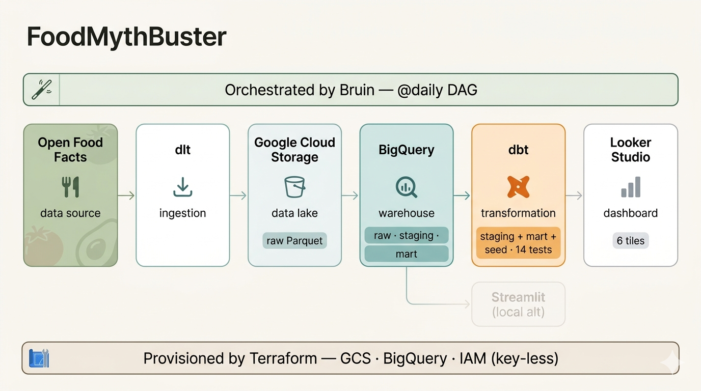
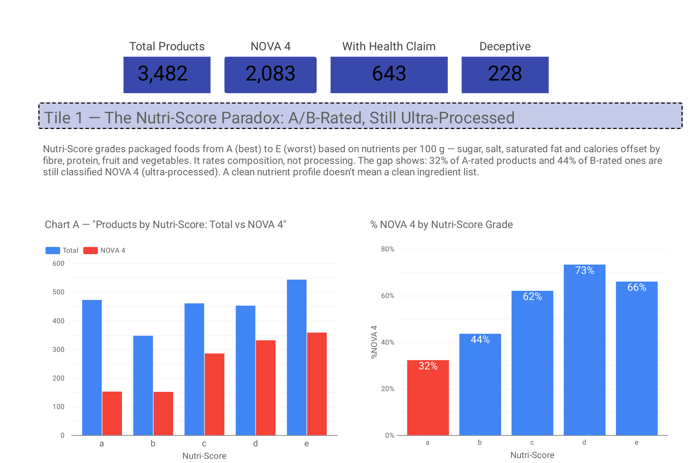
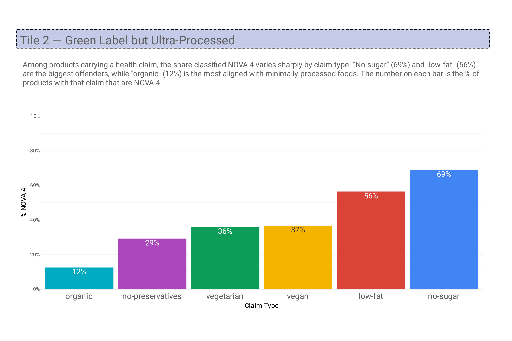
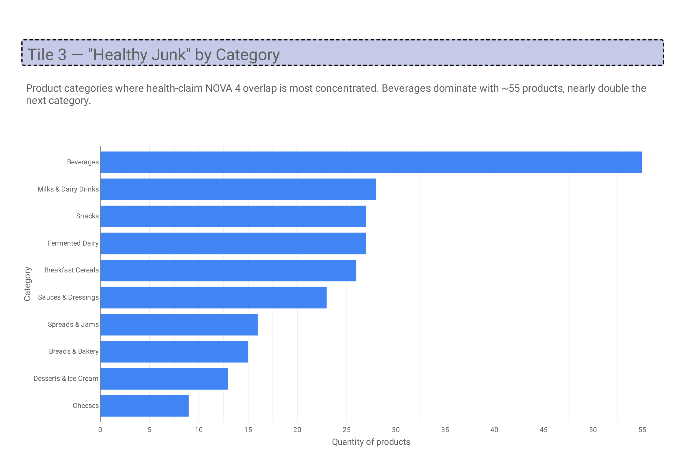
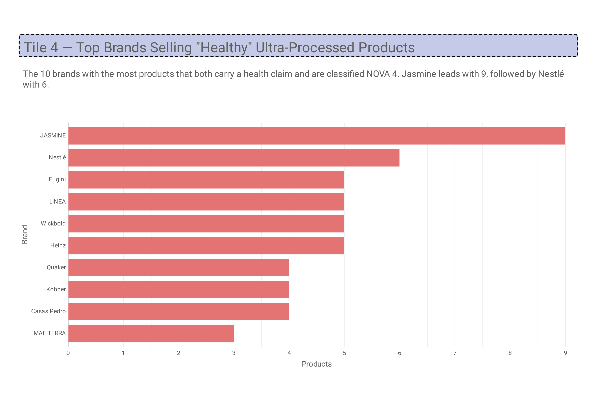
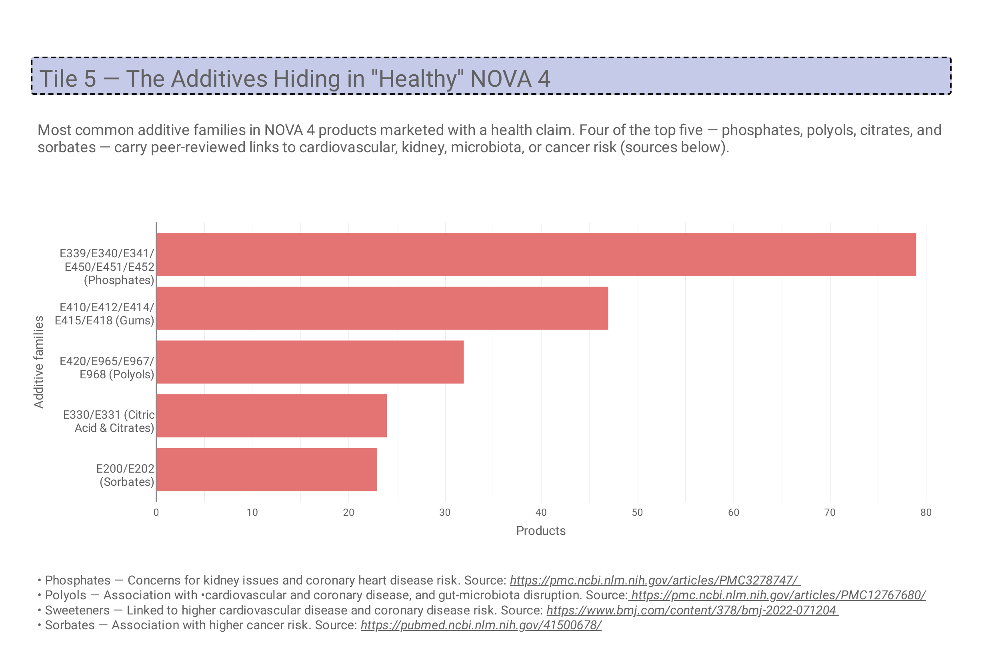
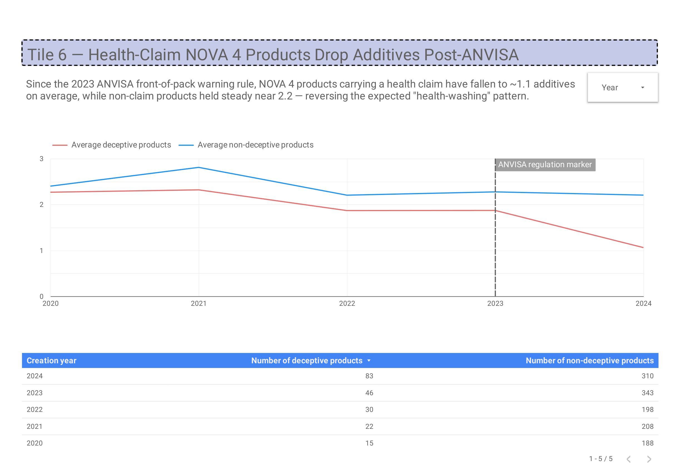

# FoodMythBuster

> Are "healthy" food labels a lie?

An end-to-end data pipeline that investigates whether front-of-pack health claims — *organic*, *natural*, *light*, *protein*, *zero* — are meaningful, or whether **NOVA classification** (degree of industrial processing) tells a more honest story about what we eat.

Built as a [Data Engineering Zoomcamp](https://github.com/DataTalksClub/data-engineering-zoomcamp) capstone project. *Scope: Brazilian products on Open Food Facts.*

---

## The Problem

A product can be **Nutri-Score A**, **certified organic**, and **low-fat** — and still be **NOVA Group 4** (ultra-processed). Large cohort studies link ultra-processing *itself* to cardiovascular disease, obesity and kidney issues, independent of nutrient profile ([Srour et al., BMJ 2019](https://www.bmj.com/content/365/bmj.l1451)).

In the Brazil slice of Open Food Facts, **34.3% of products carrying a front-of-pack health claim are NOVA 4** — hundreds of items marketed as "healthy" that the research says we should be eating less of.

**FoodMythBuster** ingests Open Food Facts into a cloud warehouse, transforms it into analytical models, and exposes the gap between health claims and ultra-processing through six dashboard tiles that each answer one question:

| # | Question | Dashboard tile |
|---|---|---|
| 1 | What share of products with a health claim are NOVA 4? | Nutri-Score paradox |
| 2 | Which claims most often sit on ultra-processed products? | Green-label lies |
| 3 | Which categories are the worst offenders? | Healthy junk by category |
| 4 | Which brands sell the most deceptive products? | Top deceptive brands |
| 5 | Which additive families dominate — and what does research say? | Top additives + links |
| 6 | Is the additive gap widening over time? | Temporal trend |

> **Scope note.** The default scope is Brazilian products with `nova_group` classified (GS1 prefixes `789*` / `790*`). Set `FOODMYTHBUSTER_SCOPE=global` to ingest every country instead — or run `make dev-global` for the local one-shot. Every downstream model and tile stays the same; only the ingest WHERE clause flips.

*NOVA classification: Prof. Carlos Monteiro, University of São Paulo.*

---

## Architecture




dbt materialises: `stg_products` (partitioned + clustered) · `mart_deceptive_by_category` (pre-aggregated) · `health_claims` (seed dictionary).

A Streamlit + Plotly app (`dashboard/app.py`) is retained as a local alternative that reads either DuckDB (dev) or BigQuery.

---

## Stack

| Layer | Tool | Notes |
|---|---|---|
| Data source | [Open Food Facts](https://world.openfoodfacts.org) (CC BY-SA) | via HuggingFace Parquet export |
| Ingestion | [dlt](https://dlthub.com) | incremental merge on `last_modified_t` |
| Data lake | Google Cloud Storage | 90-day NEARLINE lifecycle |
| Warehouse | BigQuery | partitioned + clustered |
| Transformations | [dbt](https://www.getdbt.com) | staging + mart + seed, 14 tests |
| Orchestration | [Bruin](https://getbruin.com) | 2-node DAG, `@daily` schedule |
| Infrastructure | Terraform | key-less SA impersonation |
| Dashboard | Looker Studio (primary) · Streamlit + Plotly (alt) | 6 tiles |

---

## Dashboard

**→ [Open the live Looker Studio dashboard](https://datastudio.google.com/reporting/73c0c594-b5c9-44df-999d-faa7573c5e3a)**

### Brazil scope








> **About the 2023 marker on Tile 6 (temporal trend).** The dashed vertical line marks the rollout of ANVISA's **RDC 429/2020** — Brazil's front-of-pack warning-label rule that mandates black "magnifying-glass" icons on packages high in added sugar, saturated fat, or sodium (in force from October 2022, with manufacturers reformulating through 2023). It anchors the chart as a before/after reference: did the additive gap between deceptive (health-claim-bearing) NOVA 4 products and other NOVA 4 products shift once mandatory warnings hit shelves?

### Global scope

[Global dashboard snapshot (PDF)](docs/images/Global_Streamlit_FoodFacts_Nova4.pdf)

Tile-by-tile spec: [docs/looker-studio-guide.md](docs/looker-studio-guide.md).
Underlying queries: [docs/looker-studio-queries/](docs/looker-studio-queries/).

The six tiles cover the Nutri-Score paradox, green-label lies, healthy-junk by category, top deceptive brands, top additive families (with linked health-concern research), and the temporal additive-gap trend between deceptive and non-deceptive NOVA 4 products.

---

## Quick start

Cloud run, one shot:

```bash
git clone https://github.com/hiagofng/FoodMythBuster.git && cd FoodMythBuster

# Create + activate a virtualenv (uv is ~10-100x faster than pip; see Prerequisites)
uv venv
source .venv/bin/activate          # macOS / Linux
# .venv\Scripts\activate           # Windows (cmd / PowerShell)
# source .venv/Scripts/activate    # Windows (Git Bash)

uv pip install -r requirements.txt
# Fallback without uv: python -m venv .venv && pip install -r requirements.txt

cp .env.example .env                                # fill in your GCP values
cp infra/terraform.tfvars.example infra/terraform.tfvars
cp .bruin.yml.example .bruin.yml

gcloud auth login
gcloud auth application-default login

make infra                                # provision GCS + BigQuery + SA + IAM
make build                                # ingest → dbt build (Brazil scope, default)
# FOODMYTHBUSTER_SCOPE=global make build  # same, but ingest every country
make dashboard                            # Streamlit against BigQuery (Looker is browser-only)
```

Local-only run against DuckDB (no cloud account needed):

```bash
make dev            # Brazil scope (default)
make dev-global     # every country — equivalent to FOODMYTHBUSTER_SCOPE=global make dev
```

`make help` lists every target.

---

## Prerequisites

| Tool | Version | Install |
|---|---|---|
| Python | 3.11+ | https://www.python.org/downloads/ |
| [uv](https://docs.astral.sh/uv/) (Python installer) | latest | Windows: `winget install astral-sh.uv` · macOS/Linux: `curl -LsSf https://astral.sh/uv/install.sh \| sh`. Falls back to `pip` if you skip it. |
| [Bruin CLI](https://getbruin.com) | latest | `curl -LsSf https://raw.githubusercontent.com/bruin-data/bruin/refs/heads/main/install.sh \| sh` |
| [dbt](https://www.getdbt.com) + dbt-bigquery | ≥ 1.7 | `pip install dbt-bigquery` (bundled in `requirements.txt`) |
| [Terraform](https://developer.hashicorp.com/terraform) | ≥ 1.5 | https://developer.hashicorp.com/terraform/install |
| `gcloud` CLI | latest | https://cloud.google.com/sdk/docs/install |
| `make` | any | macOS/Linux: pre-installed. Windows: `winget install GnuWin32.Make`, `choco install make`, or run inside WSL Ubuntu. Git Bash alone does **not** include make. |

A **GCP project with billing enabled** is required for the cloud path. `make dev` needs none of the cloud tooling.

> **Note on Python vs system tools.** The table above is one-time system-level setup. Every **Python** dependency (dlt, dbt-bigquery, streamlit, plotly, the `google-cloud-*` client libraries, pyarrow, gcsfs, db-dtypes, etc.) is pinned in `requirements.txt` and installed in one shot via `uv pip install -r requirements.txt` (or `make install`). Plain `pip install -r requirements.txt` works identically if you skipped uv. No Python package is assumed pre-installed.

---

## Repo structure

```
.
├── infra/                              # Terraform: GCS + BigQuery + SA + IAM
├── pipelines/foodmythbuster/           # Bruin orchestration
│   ├── pipeline.yml
│   └── assets/
│       ├── off_brazil_products.py      # dlt ingest (DuckDB or BigQuery)
│       └── dbt_build.py                # dbt build wrapper (picks target from FOODMYTHBUSTER_TARGET)
├── dbt/foodmythbuster/
│   ├── dbt_project.yml
│   ├── profiles.yml
│   ├── seeds/
│   │   └── health_claims.csv           # front-of-pack claim dictionary
│   └── models/
│       ├── staging/
│       │   ├── stg_products.sql        # partitioned + clustered
│       │   ├── sources.yml
│       │   └── schema.yml
│       └── marts/
│           ├── mart_deceptive_by_category.sql
│           └── schema.yml
├── dashboard/app.py                    # Streamlit + Plotly (dual backend)
├── docs/
│   ├── looker-studio-guide.md          # tile-by-tile spec
│   ├── looker-studio-tile-descriptions.md
│   └── looker-studio-queries/          # SQL backing each tile
├── queries/explore.sql                 # ad-hoc exploration
├── Makefile                            # one-command runners
├── .env.example
└── .bruin.yml.example
```

---

## Reproducibility — step by step

### Phase 1 — Provision GCP infrastructure

Everything under `infra/` provisions the GCS data lake, BigQuery dataset, and pipeline service account with the correct IAM bindings. **No service-account keys are created** — local dev uses your own user credentials via [Application Default Credentials](https://cloud.google.com/docs/authentication/application-default-credentials), and the SA is reached by impersonation.

```bash
gcloud auth login
gcloud auth application-default login
gcloud config set project YOUR_PROJECT_ID

cp infra/terraform.tfvars.example infra/terraform.tfvars
# Edit infra/terraform.tfvars:
#   project_id          = your GCP project ID
#   bucket_name_suffix  = a globally-unique suffix
#   user_email          = your gcloud account email (for SA impersonation)

make infra
```

This creates roughly 11 resources: 4 API enablements, a GCS bucket (`foodmythbuster-raw-<suffix>`), a BigQuery dataset (`foodmythbuster`), a pipeline service account, and its IAM bindings (`storage.objectAdmin` on the bucket, `bigquery.dataEditor` on the dataset, `bigquery.jobUser` at project level).

Verify:

```bash
gcloud storage ls gs://foodmythbuster-raw-<suffix>
bq ls --location=southamerica-east1 YOUR_PROJECT_ID:foodmythbuster
```

Teardown when done: `make infra-destroy`.

### Phase 2 — Configure credentials

```bash
cp .env.example .env
cp .bruin.yml.example .bruin.yml
# Edit both with your GCP project ID, bucket, and region.
```

`.env` feeds the Makefile + dbt + dlt; `.bruin.yml` is Bruin's own connection config. Both are gitignored.

### Phase 3 — Run the pipeline

The ingestion asset picks its destination from `FOODMYTHBUSTER_TARGET` (default `duckdb`). Both paths use the **same Python asset** — only the destination differs.

**Cloud (BigQuery)** — definitive path:

```bash
gcloud auth application-default login   # refresh ADC for dbt
make build                              # Bruin runs the full DAG
```

Bruin executes two DAG nodes:

1. **`off_brazil_products.py`** — dlt stages the raw Parquet into `gs://$GCS_BUCKET/` and merges it into `foodmythbuster.off_brazil_products`.
2. **`dbt_build.py`** — shells out to `dbt build`, which seeds `health_claims`, materialises `stg_products` (partitioned + clustered, see *Data Modeling*) and `mart_deceptive_by_category`, and runs all 14 schema tests.

Run each phase separately if you prefer: `make ingest` then `make transform`.

**Local (DuckDB)** — no cloud needed:

```bash
make dev
```

Data lands in `data/foodmythbuster.duckdb` (schemas `raw` and `staging`) and the Streamlit dashboard opens against it.

> **What you'll see in BigQuery after a cloud run:**
> - `foodmythbuster.off_brazil_products` — authoritative raw table
> - `foodmythbuster.stg_products` — partitioned + clustered staging model
> - `foodmythbuster.mart_deceptive_by_category` — pre-aggregated mart
> - `foodmythbuster.health_claims` — dbt seed (claim dictionary)
> - `foodmythbuster._dlt_loads`, `_dlt_pipeline_state`, `_dlt_version` — dlt load history & incremental cursor
> - `foodmythbuster_staging.*` — dlt's temporary merge-staging dataset; not a transformation layer
>
> Ingestion uses backend- and scope-specific pipeline names (`foodmythbuster_duckdb_{brazil|global}` / `foodmythbuster_bq_{brazil|global}`) so incremental cursors stay isolated — switching either `FOODMYTHBUSTER_TARGET` or `FOODMYTHBUSTER_SCOPE` never leaks state across destinations or scopes.

### Phase 4 — Launch the dashboard

Three paths depending on what you want to see:

- **Looker Studio public link** (primary, pinned in *Dashboard* above) — reads the author's BigQuery tables. The fastest "is the dashboard as intended" check; no Looker setup required.
- **Streamlit** — reads *your own* freshly-built BigQuery (or DuckDB) tables, so you can verify the pipeline you just ran produces valid dashboard-ready data:
  ```bash
  make dashboard         # uses FOODMYTHBUSTER_BACKEND from .env
  ```
  Streamlit opens at http://localhost:8501 with the same six tiles. Every BigQuery query is capped at **1 GB scanned** (`maximum_bytes_billed`) and cached in-process for 10 minutes (`@st.cache_data(ttl=600)`) — both safety nets against runaway costs.
- **Rebuild Looker Studio against your own BigQuery** — follow [docs/looker-studio-guide.md](docs/looker-studio-guide.md) tile by tile. Optional; useful if you want to fork the dashboard and extend it.

---

## Data Modeling

`foodmythbuster.stg_products` is physically laid out to match the dashboard's access pattern — pruning both rows and bytes-scanned on every tile.

**Partitioning** — `PARTITION BY created_date` (the date the product was added to Open Food Facts).
Tile 6 filters `created_date BETWEEN '2020-01-01' AND '2024-12-31'` — the window where Brazilian product ingestion on Open Food Facts is dense enough for year-over-year comparisons. Earlier years are too sparse to support a trend (~dozens of products per year), and 2025 is still accumulating. BigQuery prunes all partitions outside that window before any scan. Partitioning on `created_date` also enables partition-level retention policies and cheap incremental dbt rebuilds.

**Clustering** — `CLUSTER BY is_deceptive, nutriscore_grade, is_ultra_processed`.
Five of the six tiles filter or group by one or more of these fields:

| Tile | Filter / Group | Cluster benefit |
|---|---|---|
| 1 · Nutri-Score paradox | `GROUP BY nutriscore_grade`, `is_ultra_processed` | ✓ both |
| 2 · Green label | `WHERE has_health_claim + is_ultra_processed` | ✓ |
| 3 · Healthy junk by category | `WHERE is_deceptive` | ✓ leading cluster key |
| 4 · Top brands | `WHERE is_deceptive` | ✓ leading cluster key |
| 5 · Top additive families | `WHERE is_deceptive` | ✓ leading cluster key |
| 6 · Temporal gap | `WHERE is_ultra_processed` + partition prune | ✓ + partition |

The layout is chosen because it is the *correct* layout for the query pattern at any scale. Re-pointing the pipeline at the global OFF dataset (~3 M products, ~2 GB) keeps every tile reading only a few MB.

**Mart layer.** `mart_deceptive_by_category` pre-aggregates Tile 3: one row per OFF category tag with the share of products that carry a health claim *and* are NOVA 4. Dashboard tiles read the mart directly instead of re-unnesting `categories_tags` on every refresh.

**Seed layer.** The 14 front-of-pack claim tags (`en:organic`, `en:light`, `en:high-protein`, …) live in `seeds/health_claims.csv` — edited by humans, versioned with the model, and joined into `stg_products` via `{{ ref('health_claims') }}`.

---

## Dataset

**[Open Food Facts](https://world.openfoodfacts.org)** — crowdsourced, 3 M+ products globally, updated daily. Ingested via the **Parquet export** hosted on [HuggingFace](https://huggingface.co/datasets/openfoodfacts/product-database), filtered to Brazilian products (GS1 prefixes `789*` / `790*`) with `nova_group` classified.

Key fields: `code`, `product_name`, `nova_group` (1–4), `nutriscore_grade` (A–E), `labels_tags`, `brands`, `categories_tags`, `additives_tags`.

---
